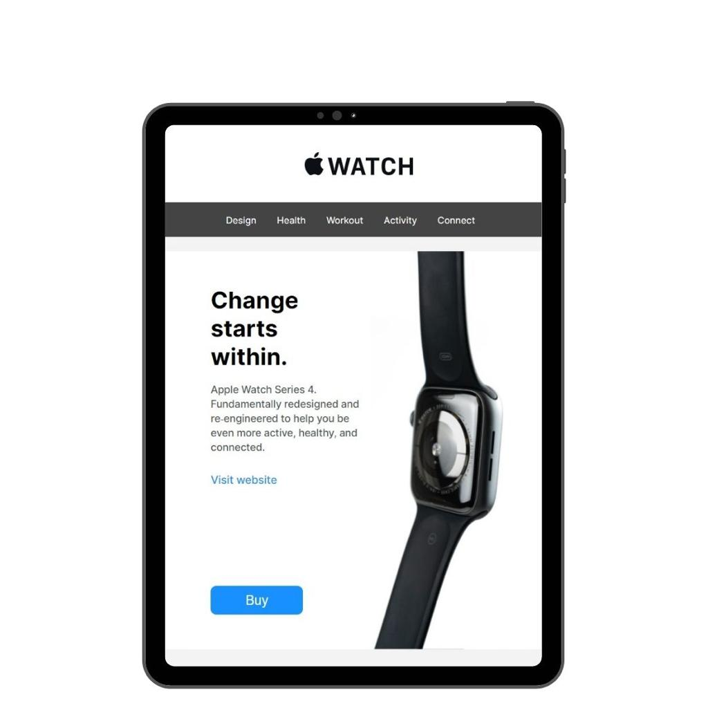
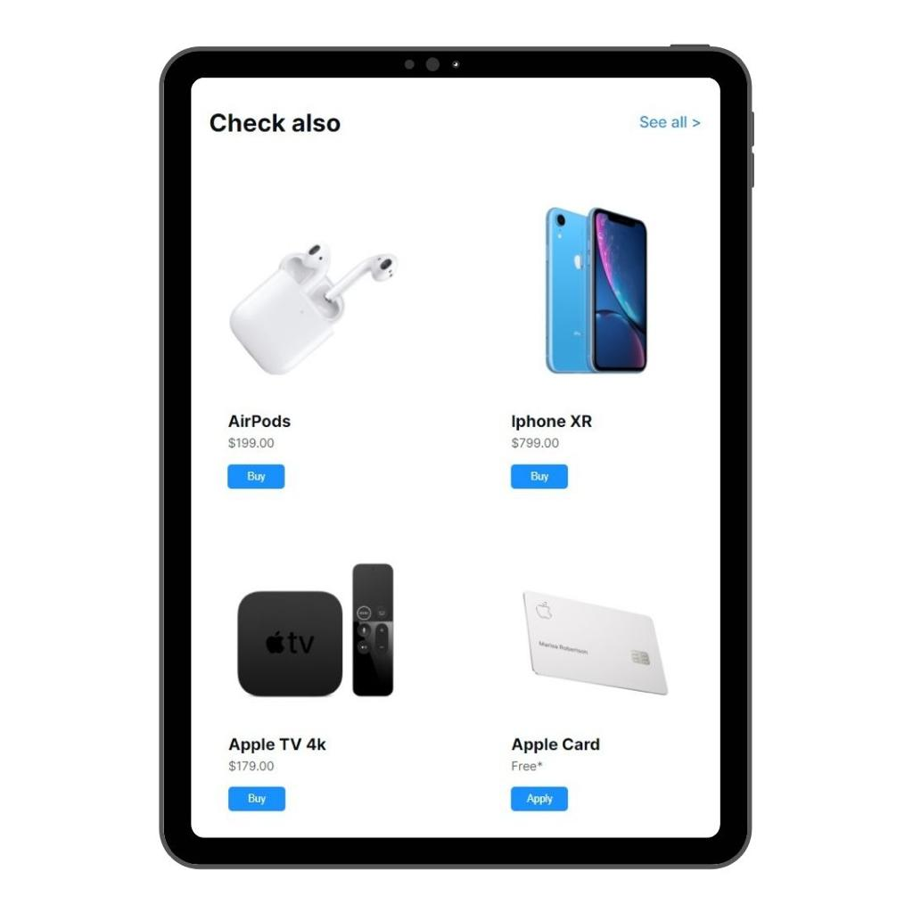
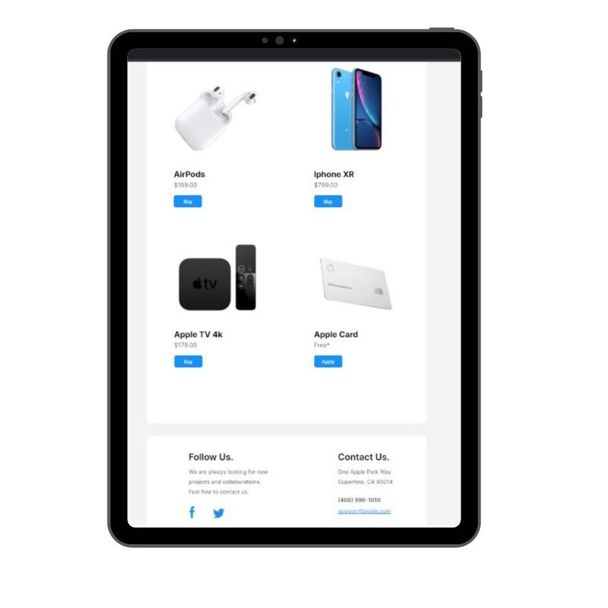

# Apple-shop

> Projeto para exibição de produto (Apple Watch) e grade de compra para outros produtos Apple.

### Ajustes e melhorias

O projeto ainda está em desenvolvimento e as próximas atualizações serão voltadas nas seguintes tarefas:

- [x] HTML5
- [x] CSS
- [ ]  JavaScript

## 🤝 Colaborador

<table>
  <tr>
    <td align="center">
      <a href="https://github.com/daancorrea">
         
        
          <b>Daniel Correa</b>
        
      </a>
    </td>
</table>

## 📝 Licença
